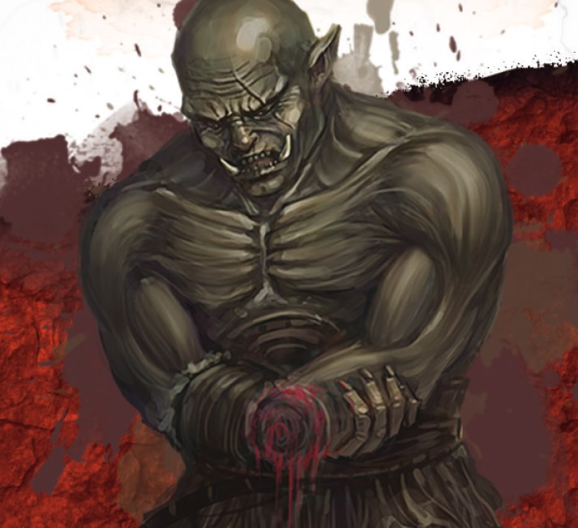

<h1 align="center">D&D Critical Hit Bot</h1>

<p align="center">A Discord bot that resolves extended critical-hit rules for Dungeons & Dragons — so your party can keep the story moving instead of flipping through rulebooks.</p>

<p align="center">
  
  
  
  
</p>

<p align="center">
  
</p>

---

## What it does

When a player rolls a natural 20 in D&D 5e, the result depends on the type of damage being dealt and which side of the table you're on (player or DM). The official rulings live in two Nord Games sourcebooks — *Critical Hits for Players* and *Critical Hits for Game Masters* — which each contain a hundred-plus possible outcomes spread across damage types.

This bot replaces flipping through those books with a single Discord slash command. It also integrates with the [LongStoryShort](https://longstoryshort.app/) interactive character sheet so that any d100 roll made there is automatically resolved in your channel.

## Features

- **Slash commands** for player crits, GM crits, spell crits (by damage type), and anti-crits
- **Webhook integration** with LongStoryShort — auto-rolls trigger a critical-hit response in chat
- **Damage-type aware** — fire, cold, necrotic, radiant, etc. each pull from the correct table
- **Lightweight** — single-file bot, no database, runs anywhere Python runs

## Demo

| Slash commands | Webhook integration |
|:--:|:--:|
|  |  |

## Tech stack

- **Python 3.10+**
- **discord.py 2.x** — for the Discord client and slash command framework
- **aiohttp** — for the LongStoryShort webhook listener

## Getting started

### Prerequisites

- Python 3.10 or newer
- A Discord account and a server you can manage
- A Discord bot token (see [Discord's developer docs](https://discord.com/developers/docs/quick-start/getting-started))

### Installation

```bash
# Clone the repo
git clone https://github.com/AlekseiLopatin/dnd-critical-hit-bot.git
cd dnd-critical-hit-bot

# Create and activate a virtual environment
python -m venv venv
source venv/bin/activate   # on Windows: venv\Scripts\activate

# Install dependencies
pip install -r requirements.txt
```

### Configuration

Create a `.env` file in the project root:

```env
DISCORD_TOKEN=your-bot-token-here
GUILD_ID=your-discord-server-id
```

Then invite the bot to your server using the OAuth2 URL generated in the Discord developer portal — the bot needs `Send Messages`, `Use Slash Commands`, and `Embed Links` permissions.

### Run

```bash
python bot/main.py
```

The bot stays online as long as the process is running. For 24/7 operation, deploy it to a service like [Railway](https://railway.app/) or a small VPS.

## Usage

| Command | Who uses it | What it does |
|---|---|---|
| `/crit <number>` | Players | Looks up a player critical-hit result by d100 roll |
| `/critgm <number>` | Dungeon Masters | Looks up a GM critical-hit result by d100 roll |
| `/critspell <number> <damage_type>` | Players & DMs | Resolves a magic critical hit by damage type (fire, cold, necrotic, etc.) |
| `/anticrit <number>` | Players & DMs | Resolves an anti-crit (a roll of 1 with consequences) |

If you have the LongStoryShort webhook configured, you don't need to invoke any command — d100 rolls in the character sheet trigger the bot automatically.

## Project structure

```
dnd-critical-hit-bot/
├── bot/
│   ├── main.py              # Bot entry point and command registration
│   ├── crit_tables.py       # Player and GM critical-hit lookup tables
│   ├── spell_tables.py      # Damage-type tables for magical crits
│   └── webhook.py           # LongStoryShort webhook listener
├── docs/
│   └── screenshots/         # Images used in this README
├── requirements.txt
├── LICENSE
└── README.md
```

## Roadmap

- [ ] Configurable rule sets (5e, Pathfinder, homebrew)
- [ ] Per-server settings stored in a small DB
- [ ] Dockerfile for one-command deploy
- [ ] Unit tests for the lookup tables

## Credits

The critical-hit tables themselves are the work of [Nord Games](https://nordgamesllc.com/), used here for personal play only:

- [*Critical Hits for Players*](https://nordgamesllc.com/)
- [*Critical Hits for Game Masters*](https://nordgamesllc.com/)

If you use this bot regularly, consider buying their books to support the creators.

Other things this project depends on:

- [discord.py](https://discordpy.readthedocs.io/) — the Python Discord API wrapper
- [LongStoryShort](https://longstoryshort.app/) — the interactive character sheet that powers webhook rolls

## License

Distributed under the MIT License. See [`LICENSE`](LICENSE) for details.

Note: This bot is intended for personal use with friends. The rule content itself remains the intellectual property of Nord Games.
